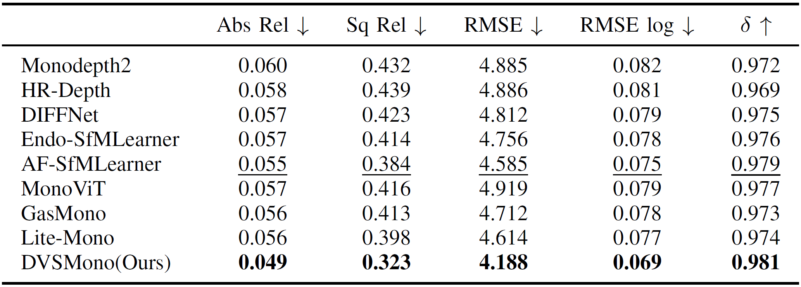
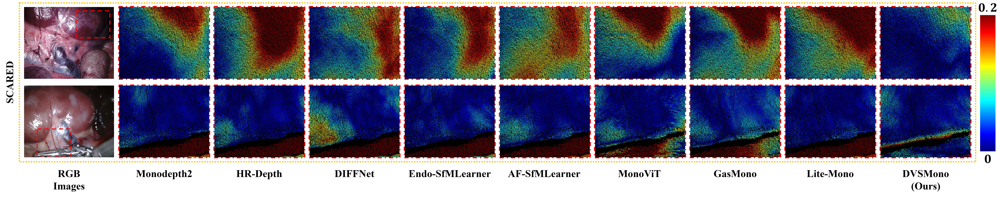

# DVSMono

This is a PyTorch implementation for **Improved Self-supervised Monocular Endoscopic Depth Estimation based on Pose Alignment-friendly Dynamic View Selection**.

## ⚙️ Setup

Our experiments are conducted in a [conda](https://www.anaconda.com/download) environment and you can use the below commands to install necessary dependencies:
```shell
pip3 install torch==1.9.0+cu111 torchvision==0.10.0+cu111 torchaudio==0.9.0
pip install dominate==2.4.0 Pillow==6.1.0 visdom==0.1.8
pip install tensorboardX==1.4 opencv-python  matplotlib scikit-image
pip3 install mmcv-full==1.3.0 mmsegmentation==0.11.0  
pip install timm einops IPython
```

## 🖼️ Prediction for a single image or a folder of images

You can predict scaled disparity for a single image or a folder of images with:
```shell
CUDA_VISIBLE_DEVICES=0 python test_simple.py --model_path <your_model_path> --image_path <your_image_or_folder_path>
```

## 💾 Data Preparation

The datasets in our experimental results are [SCARED](https://endovissub2019-scared.grand-challenge.org)(additional application to max.allan@intusurg.com is necessary), [SERV-CT](https://www.ucl.ac.uk/interventional-surgical-sciences/serv-ct) and [Hamlyn](https://hamlyn.doc.ic.ac.uk/vision/).

**SCARED split**

The train/test split for SCARED in our works is defined in the `splits/endovis` and further preprocessing is available in [AF-SfMLearner](https://github.com/ShuweiShao/AF-SfMLearner).


## 📊 Evaluation

To prepare the ground truth depth maps, please follow the [AF-SfMLearner](https://github.com/ShuweiShao/AF-SfMLearner/blob/main/export_gt_depth.py). For convenience, here we provide the model files([Google drive](https://drive.google.com/drive/folders/1ypcUhZQg60K6OYknws6c3SNnMioh2pdX?usp=sharing) or [Onedrive](https://1drv.ms/f/s!AuZZZn08Vq4BfcYqeBopvvtkAgY?e=HtcsWp)) to reproduce the reported results.

To evaluate model performance on SCARED, you need to run the following command: 
```shell
CUDA_VISIBLE_DEVICES=0 python evaluate_depth.py --data_path <your_data_path> --load_weights_folder <your_weight_path> \
    --eval_split endovis --dataset endovis  --max_depth 150 --png --eval_mono
```

## Quantitative and qualitative results

<p align="center">
 
</p>

<p align="center">
 
</p>

## ⏳ To do

Currently, we have released the evaluation code and model weight files of DVSMono, which can reproduce the result in our work. In the near future, we will continue to update the model zoo and complete procedure of **DVS**, including Temporally-Consistent View Scoring (**TCVS**) and Photometric-Valid Region Computation (**PVRC**).

## Acknowledgement
Thanks the authors for their works:

[MonoViT](https://github.com/zxcqlf/monovit)

[AF-SfMLearner](https://github.com/ShuweiShao/AF-SfMLearner)